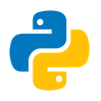

<h1 align="center">
Bem-vindo(a), eu sou o Diego Crivelaro 👋🤓
</h1>

    <h2>Sobre mim 😄</h2>
    
Desde adolescente interesso pela área da tecnologia, principalmente pela área da <b>programação</b> e da <b>cibersegurança</b>. Atualmente sou <b>vestibulando</b>, e estou tentando uma vaga no curso de <b>Ciência da Computação</b> na ICMC-USP em São Carlos.

    <h3>Linguagens</h3>
        

            <code>
                 
            </code>
            <code>
                 
            </code>
            <code>
                 
            </code>
        

    <h3>Frameworks</h3>
    
Estudando 📘

    <h3>🛠 Ferramentas</h3>
        

            <code>
                 
            </code>
            <code>
                 
            </code>
            <code>
                 
            </code>
            <code>
                 
            </code>
            <code>
                 
            </code>
            <code>
                 
            </code>
            <code>
                 
            </code>
            <code>
                 
            </code>
        

<h3>⚙ Estatísticas do GitHub</h3>

     
    

